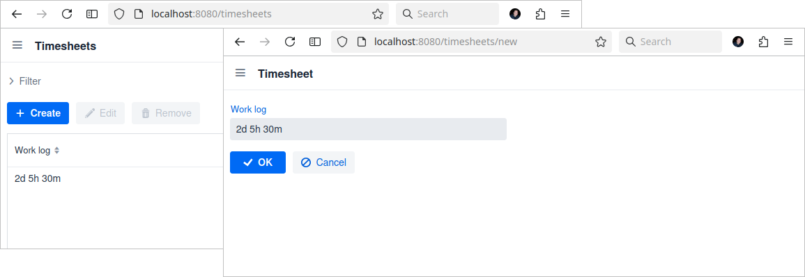
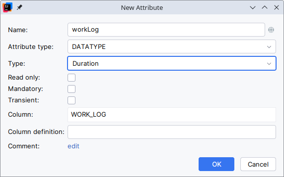
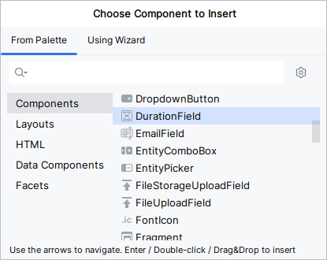

[](http://www.apache.org/licenses/LICENSE-2.0)

# Duration Field for Jmix

This add-on provides support for the `java.time.Duration` datatype and a related field, by converting the datatype in a human-readable format.



## Installation

The following table shows which version of the add-on is compatible with which version of the platform:

| Jmix Version | Add-on Version | Implementation                                    |
|--------------|----------------|---------------------------------------------------|
| 1.2.1        | 1.0.0          | gr.netmechanics.jmix:duration-field-starter:1.0.0 |
| 1.2.2        | 1.2.0          | gr.netmechanics.jmix:duration-field-starter:1.2.0 |
| 1.3.0        | 1.3.1          | gr.netmechanics.jmix:duration-field-starter:1.3.1 |
| 1.4.0        | 1.4.0          | gr.netmechanics.jmix:duration-field-starter:1.4.0 |
| 1.5.0        | 1.5.0          | gr.netmechanics.jmix:duration-field-starter:1.5.0 |
| 2.4.x        | 2.0.0          | gr.netmechanics.jmix:duration-field-starter:2.0.0 |
| 2.5.x        | 2.1.0          | gr.netmechanics.jmix:duration-field-starter:2.1.0 |
| 2.6.x        | 2.2.0          | gr.netmechanics.jmix:duration-field-starter:2.2.0 |
| 2.7.x        | 2.3.0          | gr.netmechanics.jmix:duration-field-starter:2.3.0 |

For manual installation, add the following dependencies to your `build.gradle`:

```gradle
implementation 'gr.netmechanics.jmix:duration-field-starter:<addon-version>'
```
## How to use the add-on

### Datatype

You can define an entity attribute with the `java.time.Duration` datatype using Studio.



As a result, Studio generates the following attribute definition:

```java
@Column(name = "WORK_LOG") 
private Duration workLog;
```

### Field

In a detail view you can add the field from studio `Component Palette` window



or through code

```xml
<view xmlns="http://jmix.io/schema/flowui/view"
        xmlns:nm="http://schemas.netmechanics.gr/jmix/ui"
        focusComponent="form">
    ...
    <layout>
        <formLayout id="form">
            <nm:durationField id="workLogField" property="workLog" />
        </formLayout>
        ...
    </layout>
</view>
```
