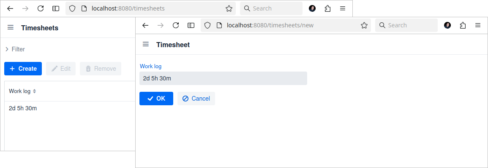
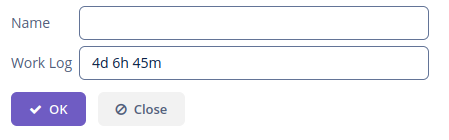
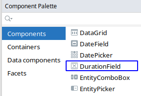

[](http://www.apache.org/licenses/LICENSE-2.0)

# Jmix Duration Field

This add-on provides support for the `java.time.Duration` data type through a specific UI component, by converting the type in a human redable format.





## Installation

The following table shows which version of the add-on is compatible with which version of the platform:

| Jmix Version | Add-on Version | Implementation                                    |
|--------------|----------------|---------------------------------------------------|
| 1.2.1        | 1.0.0          | gr.netmechanics.jmix:duration-field-starter:1.0.0 |
| 1.2.2        | 1.2.0          | gr.netmechanics.jmix:duration-field-starter:1.2.0 |
| 1.3.0        | 1.3.0          | gr.netmechanics.jmix:duration-field-starter:1.3.0 |

Add to your project's `build.gradle` dependencies:

```gradle
implementation 'gr.netmechanics.jmix:duration-field-starter:1.3.0'
```
## How to use the add-on

When you define an entity attribute of `java.time.Duration` type, the framework will use the custom JPA converter and datatype provided by the add-on

```java
@Column(name = "WORK_LOG") 
private Duration workLog;
```
In an edit screen you can drag&drop the field from studio `Component Palette` window



or through code

```xml
<window xmlns="http://jmix.io/schema/ui/window"
        xmlns:nm="http://schemas.netmechanics.gr/jmix/ui"
        focusComponent="form">
    ...
    <layout spacing="true" expand="editActions">
        <form id="form" dataContainer="entityDc">
            <column width="350px">
                <nm:durationField id="workLogField" property="workLog" />
            </column>
        </form>
        ...
    </layout>
</window>
```

## Messages

Component has description and input prompt specified by default in two languages, English and Greek. 

You can modify them by giving the corresponding attributes of the field in the code, or overwriting the messages.

| Message Key                               | Attribute   |
|-------------------------------------------| ----------- |
| gr.netmechanics.jmix.durationField/prompt | inputPrompt |
| gr.netmechanics.jmix.durationField/help   | description |
