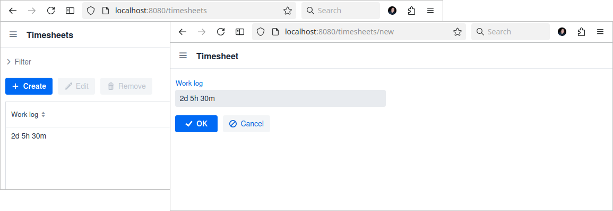
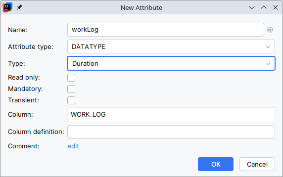
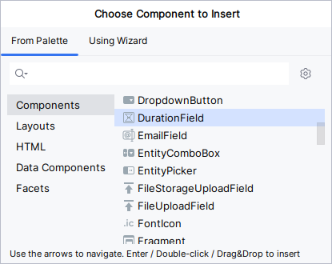

[](http://www.apache.org/licenses/LICENSE-2.0)

# Duration Field for Jmix

This add-on provides support for the `java.time.Duration` datatype and a related field, displaying durations in a human-readable format (e.g. `1d 6h` instead of a raw number of milliseconds). It's built for timesheet, planning, and invoicing apps: you can set how many hours make up a working day for each customer, and choose to always show durations in one consistent unit — like days — no matter how they were entered.



## Installation

The following table shows which version of the add-on is compatible with which version of the platform:

| Jmix Version | Add-on Version | Implementation                                    |
|--------------|----------------|---------------------------------------------------|
| 1.2.1        | 1.0.0          | gr.netmechanics.jmix:duration-field-starter:1.0.0 |
| 1.2.2        | 1.2.0          | gr.netmechanics.jmix:duration-field-starter:1.2.0 |
| 1.3.0        | 1.3.1          | gr.netmechanics.jmix:duration-field-starter:1.3.1 |
| 1.4.0        | 1.4.0          | gr.netmechanics.jmix:duration-field-starter:1.4.0 |
| 1.5.0        | 1.5.0          | gr.netmechanics.jmix:duration-field-starter:1.5.0 |
| 2.4.x        | 2.0.0          | gr.netmechanics.jmix:duration-field-starter:2.0.0 |
| 2.5.x        | 2.1.0          | gr.netmechanics.jmix:duration-field-starter:2.1.0 |
| 2.6.x        | 2.2.0          | gr.netmechanics.jmix:duration-field-starter:2.2.0 |
| 2.7.x        | 2.3.0          | gr.netmechanics.jmix:duration-field-starter:2.3.0 |
| 2.8.x        | 2.4.0          | gr.netmechanics.jmix:duration-field-starter:2.4.0 |
| 3.x.x        | 3.x.x          | gr.netmechanics.jmix:duration-field-starter:3.x.x |

For manual installation, add the following dependencies to your `build.gradle`:

```gradle
implementation 'gr.netmechanics.jmix:duration-field-starter:<addon-version>'
```
## How to use the add-on

### Datatype

You can define an entity attribute with the `java.time.Duration` datatype using Studio.



As a result, Studio generates the following attribute definition:

```java
@Column(name = "WORK_LOG") 
private Duration workLog;
```

### Field

In a detail view you can add the field from studio `Component Palette` window



or through code

```xml
<view xmlns="http://jmix.io/schema/flowui/view"
        xmlns:nm="http://schemas.netmechanics.gr/jmix/ui"
        focusComponent="form">
    ...
    <layout>
        <formLayout id="form">
            <nm:durationField id="workLogField" property="workLog" />
        </formLayout>
        ...
    </layout>
</view>
```
### Configuration

The add-on provides the following configuration properties:

| Property                             | Default | Description                                                                                                                               |
|---------------------------------------|---------|---------------------------------------------------------------------------------------------------------------------------------------------|
| `jmix.durationField.shortLabels`     | `true`  | Whether to use short labels for the duration field                                                                                        |
| `jmix.durationField.hoursADay`       | `8`     | Working hours in a day (e.g. `7.5`), used to convert between hours and days/weeks/months/years                                           |
| `jmix.durationField.alwaysDisplayIn` | (none)  | When set (e.g. `days`, `hours`, `weeks`), the field always displays the whole duration as a single decimal number in that unit (e.g. `3.75d`) instead of a multi-part breakdown |

You set them once for your app, in `application.properties`:

```properties
jmix.durationField.shortLabels=true
jmix.durationField.hoursADay=7.5
jmix.durationField.alwaysDisplayIn=days
```

#### How many hours are in a working day?

Different customers work different schedules — some do 8-hour days, others 7.5 or 7. `hoursADay` tells the field what "1 day" means for your app, and everything built on top of a day (a week, a month, a year) follows automatically.

This matters both for what gets **typed in** and what gets **shown**. If `hoursADay` is `7.5`, then someone entering `2 days` is planning 15 hours of work, and 15 hours of logged time will be shown back as `2d`.

#### Always showing one unit

Normally, a duration is shown broken into whatever units fit best — 25 hours becomes `3d 1h`. For timesheets and planning views, it's often clearer to always see the same unit, so every value is easy to compare at a glance. Setting `alwaysDisplayIn=days` does that: users can still type a duration however they like (`2 weeks`, `16 hours`, `1 month`), but it always displays as a number of days, with a decimal when it doesn't divide evenly:

| Someone enters | With an 8-hour day | With a 7.5-hour day |
|-----------------|---------------------|------------------------|
| 16 hours        | 2 days              | 2.13 days              |
| 2 weeks         | 10 days             | 10 days                |
| 30 hours        | 3.75 days           | 4 days                 |

You can point it at any unit that makes sense — hours, weeks, months, years — not just days. Leave the property unset to keep the default behavior of showing the most fitting mix of units.

### Overriding per field

`shortLabels`, `hoursADay`, and `alwaysDisplayIn` can also be set on a single `<nm:durationField>`, overriding the app-wide config for just that field:

```xml
<nm:durationField id="workLogField" property="workLog"
                   shortLabels="false" hoursADay="7.5" alwaysDisplayIn="days" />
```

The same options are exposed as getters/setters on `DurationField`, for setting them from code:

```java
workLogField.setHoursADay(7.5);
workLogField.setAlwaysDisplayIn("days");
```

### Overriding per entity attribute — `@DurationFormat`

For a given `Duration` attribute, you usually want the same display options everywhere it shows up — in the edit form *and* in grids/lists — without repeating the same XML attributes on every field and every column. `@DurationFormat` sets them once, on the entity attribute itself:

```java
@Column(name = "WORK_LOG")
@DurationFormat(shortLabels = false, hoursADay = 7.5, alwaysDisplayIn = "days")
private Duration workLog;
```

Any `<nm:durationField>` bound to `workLog` picks this up automatically — no field XML attributes needed. So does any grid or list column showing `workLog`, since the annotation is applied at the metamodel level (the same mechanism Jmix's own `@NumberFormat` uses), not per-component.

The full precedence, most to least specific:

1. A `<nm:durationField>` XML attribute / setter call on the field itself
2. `@DurationFormat` on the bound entity attribute
3. The app-wide `jmix.durationField.*` configuration

### Localization

Duration labels (both short — `d`, `h`, `m` — and long — `day`, `hour`, `minute`) are fully localizable through Jmix's standard message bundles. The add-on ships English, French, and Greek translations out of the box. To add or override a language, define the same keys in your own app under `messages_<locale>.properties` in package `gr/netmechanics/jmix/df/`:

```properties
durationUnit.DAYS.short = d
durationUnit.DAYS.long = day
durationUnit.DAYS.long.plural = days
```

Each of the eight units (`MILLISECONDS`, `SECONDS`, `MINUTES`, `HOURS`, `DAYS`, `WEEKS`, `MONTHS`, `YEARS`) has a `.short` key and `.long`/`.long.plural` keys. Remember to also list the locale in `jmix.core.available-locales` so users can actually select it. Parsing user input stays locale-independent (English/short aliases only, e.g. `2d`, `3 weeks`) — only the displayed labels are localized.
